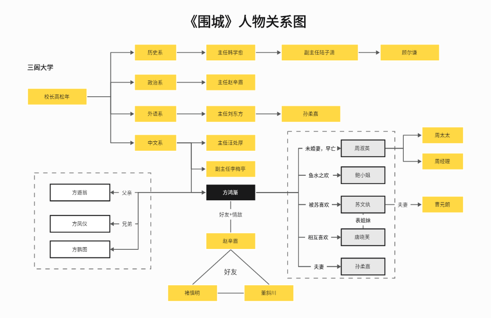

**人物分析：剖析人性的多面棱镜** 🧐

---

1、方鸿渐：本书主人公。气高学浅、未求专攻，外慧内醇、少谙世故。曾游学西欧，归国后随波逐流，然挣扎自守而不失本心。

2、赵辛楣：曾留学美国，虽出身世家，却外表世故、内心醇厚，是苏文纨青梅竹马的追求者，恋爱失意后成为方鸿渐的至交好友。

3、唐晓芙：苏文纨的表妹，聪明活泼、开朗伶俐、自然本色，是方鸿渐一见倾心、钟情追求的恋爱对象，后来因苏文纨全力挑拨而误解分手。

4、孙柔嘉：与方鸿渐和赵辛楣同赴三闾大学，任外文系英语助教。外表柔顺、心机内敛，后来嫁给方鸿渐。

5、苏文纨：法国里昂大学文学博士，出身官宦名门，“冷若冰霜，艳若桃李”，且老于世故。

6、鲍小姐：与方鸿渐、苏文纨同船归国的留学生，方鸿渐归国途中的一夜情人。

7、方父、方母：中国江浙一带传统的旧乡绅伉俪，方鸿渐的父母。

8、周父、周母：方鸿渐未过门的岳丈岳母（因其未婚妻早亡），也是送方鸿渐出国留学的出资人。

9、董斜川：赵辛楣的朋友，曾为驻外军事参赞。出身传统书香名门，家传谙熟古旧体诗律。

10、褚慎明：赵辛楣的朋友，闭门自修的“哲学家”，擅长投机取巧、故弄玄虚、自我标榜。

11、曹元朗：英国剑桥大学文学博士，后来成为苏文纨的丈夫。

12、高松年：三闾大学校长，典型的学术官僚。

13、李梅亭：三闾大学代理训导长，庸俗贪财，混迹于知识界的学术市侩。

14、汪处厚：三闾大学中国文学系主任，官场失意后退身学界。

15、汪太太：汪处厚的年青妻子，致使赵辛楣逃离三闾大学的暧昧对象，同时又是校长高松年的暧昧对象。

16、韩学愈：三闾大学历史系主任，混迹于知识界的学术骗子。

17、刘东方：三闾大学外文系主任，曾希望将妹妹嫁给方鸿渐。

18、陆子潇：三闾大学年轻教师，孙柔嘉的暗恋者，喜欢故作深沉地自吹自擂。

19、范懿：三闾大学女生指导，赵辛楣的暗恋和追求者。